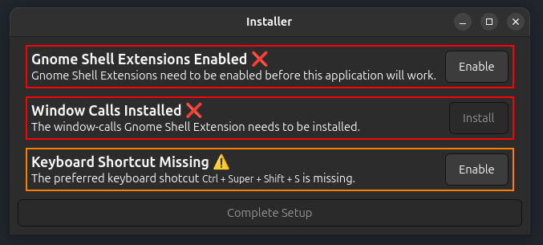

### Install: The recommended way is to use Flathub

[](https://flathub.org/en/apps/systems.fracture.launcher)

## FRACTURE: A window cropping and shading tool created with WebGPU

This is a tool written in Rust with WebGPU for Gnome Shell to fracture (crop) and shade windows on Linux.


### Pictures


### Example clips


 
 


### Performance

It does not perform well. This is an early version. It should be possible to optimize it lots, but I'm bored of writing it for now.


### Supported Hardware

I don't know yet. I've tested it on...

* a RTX 4090 (with Ubuntu 24.10)
* a GTX 970 (with Ubuntu 24.10)
* a mid 2014 MacBook Pro (also with Ubuntu 24.10)
* Virtualbox

### Known Working Desktop Environments

* Gnome Shell
    * This is directly supported, with the ability to launch directly with specific focussed windows by a keyboard shortcut
* Kde 
* Any DE that supports xdg-desktop-portal screencast 


<details>
<summary>More thoughts on other environments</summary>

At the moment, this application only supports Linux. 

Though, WebGPU is crossplatform, and works on both other desktop environments and even other operating systems like Windows or MacOS. In the future, other environments could be supported without significantly rewriting this application. However, it would require directly supporting these environments because methods to access or record a window are different on each environment.

Supporting other environments is not a goal at the moment as I only plan on supporting environments that I actively use myself. Though, if usage of this tool becomes significant I might support other environments.

</details>

### Installs a Gnome Shell Extension? (Gnome Shell only, not Kde or other Desktop Environments)
**It's not a requirement to use the extension. If it's not desired to use it, close the installer prompt and Gnome will start it with xdg-desktop-portals instead. The extension is just to make it possible to launch by focussed window without an extra prompt.**

This application installs the Gnome Shell Extension

* [Window Calls](https://extensions.gnome.org/extension/4724/window-calls/) by [domandoman](https://extensions.gnome.org/accounts/profile/domandoman)

This extension is installed to determine **open windows**, determine the **focussed window**, and to retrieve the **window IDs** assigned to obtain a pipewire stream. 

Before the installation happens, a launcher is shown to prompt the installation.




<details>
<summary>Click to see a wall of text on my personal thoughts about the Gnome Shell Extension </summary>

### It's an issue, but I don't want to fix it right now. I don't expect it to cause problems. Save yourself from reading the rest

This extension provides all applications on the system with Dbus access the ability to monitor and control windows. This is not ideal or a perfect long term solution. While it is intended by Gnome Shell to provide the ability for approved applications to access these methods, it doesn't seem like the desired goal was for Gnome Shell to have these methods globally available to all applications on the system. As an example, Dbus calls to Eval [were restricted](https://gitlab.gnome.org/GNOME/gnome-shell/-/commit/a628bbc4) several years ago.

My opinion is that the security risk from the exposed methods is overstressed. As an example, users on Linux are often requested to type `sudo` into terminal for installation of different software. This type of request is very extreme, and provides the application the power to completely uninstall, change the desktop environment or completely destroy the current install of the operating system. This simple seeming request of using `sudo` greatly extends the power of an application far beyond some methods to manage the top level windows of a desktop environment.

The exposed methods over Dbus are only accessible to software that is being executed by the system. This implies that the user already trusts the software being executed, and, in my opinion, is that for the most part the end user should not be concerned about possible access to window calls by software they already seem to trust. Though, **I don't believe this is the most optimal long term solution**.

With Wayland, [XDG Desktop Portals](https://wiki.archlinux.org/title/XDG_Desktop_Portal) have been a method to manage more so administrative seeming authorizations in a way that works across desktop environments. I think an approach for persistently authorizing applications to manage the mentioned API calls would be a more optimal long term solution. Though, my influence with Gnome Shell development is limited, and my motivation to create a custom Gnome Shell extension that tries to deliver per application approvals isn't high. In the future I may make more of an effort to improve the installed extension to a more secure alternative, but for the previous stated reasons, I think the risk is low while a more perfect solution would [unnecessarily](https://en.wiktionary.org/wiki/yak_shaving) increase my development workload.
</details>

### Future goals? Don't expect anything soon

I do want improve performance and stability, but I want to focus on other projects at the moment so it might be a while before I release new versions. 

I do have a list of simple improvements I want to make, and an older list of other considerations that are likely outdated now.

<details>
<summary>Simple improvements that I want to make soon</summary>

* Optimize (avoid shader usage, avoid copies, only use requested dmas, etc)
* Fix the AdditionalRenderingState and State to be one structure instead of two
* Fix the file size (remove array hack)
* The DmaBuffer import process isn't very good and should probably be improved
* Fix shaders to include better default names
* Clean code
* Return to previous config after resizing
* Change the default config
* Profiles (default, predefined, etc)
* Reset button? 
* Improve speed of killing

</details>

<details>
<summary>Click to expand other older considerations. Note: These are outdated and changes have been made since I originally wrote them.</summary>

* Move to winit 0.30.x or write custom window management for supported platforms?

* Release on other platforms?
    * I think xdg-desktop-portals is a good solution for Linux and I'm unlikely to support it much further. Though, I haven't confirmed it works on SteamOS, and might be likely to support that if it doesn't work there already. (I think it might though, SteamOS was built on top of Kde)
    * I don't plan on releasing for Windows or MacOS unless I think they'd be good for monetization though their stores. I don't plan on charging for Linux versions though. It is ~~open source~~  [IT WILL BE OPEN SOURCE, BUT I HAVE NOT ASSIGNED A LICENSE, AND WILL NOT UNTIL I RELEASE] though, so someone else could create their own versions for those platforms.

* Improved shader support? 
    * I really like that this tool allows someone to quickly test a shader on parts of other applications and videos. I think some of the following I like considering
        * Adding persistent buffer memory in postprocessor shaders
            * I think the shaders that can be written will be very limited in functionality until there's better persistent memory support
        * Maybe an improved postprocessing pipeline?
            * I'm interested in the idea of making it more useful for testing with computer vision ideas. In the same way that shaders can be quickly written, I like the idea of trying to make it compatible with testing or training simple real time computer vision neural networks. **Though, I have no plans yet**.
                
                Windows and MacOS have been adding more real time AI features, so a tool for actually testing simple ideas might end up being useful.

* Improved security for window calls?
    * I don't plan on doing this until the Gnome Shell Extension maintainers decide that they don't like that they allowed them. This is also Gnome Shell only, so it's not the highest priority

* Performance and optimizations?
    * Clean the pipeline code?
        * When I was benchmarking the amount of time taken for different segments of code, the largest amount of time was spent directly on `present` call to the GPU. There absolutely are repetitive uneeded reptitions of code in the pipeline, but the `present` call was taking like 15-30ms for `FIFO`. Changing to `Mailbox` or `Immediate` resulted in a much smaller delay, but caused the GPU usage to unreasonably spike for the workload. Direct frame rate management might help, but my first impression is that the most significant performance improvements will not be from removing unncessary repetitive function calls in the pipeline.
    * There's not high GPU or CPU usage, but Gnome seems to be laggging the entire desktop environment with many mirrored windows?
        * My impression is that it has nothing to do with the graphics pipeline, I think I even tested it with rendering to many windows at once with the same pipeline. It will take better understanding Gnome's screen recorder to fix and might require submitting upstream pull requests to Gnome. I don't really want to blame Gnome yet though, because I haven't taken time to clearly understand what is wrong with it.


* Remote desktop? Controlling windows through the mirror output?
    * I don't plan on writing remote desktop support, but I like the idea of controlling windows through the cropped area. As an example, I use this application to create custom versions of user interfaces when monitoring them. I think a natural extension of that goal is being able to interact with them.

* Saving settings?
    * I like this idea and it's something I want to do in the future. Like I'm considering adding a drop down on the right side of the mirror output to select a saved configuration.

    </details>

### Does this provide a way to tile or snap windows like Microsft Windows Powertoys?

No, but on Ubuntu with Gnome, I use [Tiling Shell](https://extensions.gnome.org/extension/7065/tiling-shell/) and [WinTile](https://extensions.gnome.org/extension/1723/wintile-windows-10-window-tiling-for-gnome/) at the same time. I think their combined power is better than the version provided by Windows Powertoys.

### My comments on my code quality

It needs work. There's things that I really don't like about the project, like State and AdditionalRenderingState being two parts. The code needs to be cleaned more. The project also needs to be optimized. It should be possible to greatly improve performance from the current version. 

This is an early version and I've been feeling bored of working on it. I ended up mostly using mpv to crop videos and haven't felt the need to improve it for my personal use.


<details>
<summary>Example using mpv to crop and pan videos</summary>

 

</details>

### Building

This project can be run with `cargo run` for testing purposes. If it's ran through `cargo run` it expects at least the following dependencies

```shell
sudo apt install libdbus-1-dev libpango1.0-dev libgdk-pixbuf-2.0-0 libgtk-4-dev libxml2 libpipewire-0.3-dev clang 
```
When building with `cargo run` the installer for the project cannot correctly add keyboard shortcuts and will add shortcut that cannot be used. 

To build the flatpak, open the `flatpak` folder and run the `build.sh` file. It will build and install the flatpak version. I don't how likely the script is fail, so the output will need to be monitored closely. 

### License

For Gnome only, when the extension is installed, it makes Dbus calls to a Gnome Extension that is under GPL code to receive window ids and the size of windows. See my [rust crate here](https://github.com/parker-bryce-andrew/gnome-window-calls#license) for more information. I'm not confident that some Dbus calls to a Gnome Extension under GPL code will impact this license in the same way that I would not always expect web requests to a website under GPL code to impact the license. This source in this project is being released under more permissive licenses, but the impact of the [gnome_window_calls](https://github.com/parker-bryce-andrew/gnome-window-calls) crate should be considered when making modifications. (I don't know how to interpret it)

For the rest of the code, it's licensed under either of

- Apache License, Version 2.0 ([LICENSE-APACHE](LICENSE-APACHE) or http://apache.org/licenses/LICENSE-2.0)
- MIT license ([LICENSE-MIT](LICENSE-MIT) or http://opensource.org/licenses/MIT)
